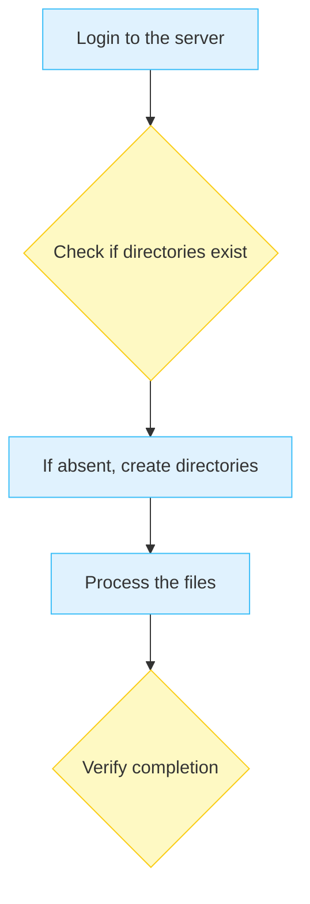

# SOP Parser - PDF to Mermaid Flowchart Converter

A comprehensive solution that extracts Standard Operating Procedures (SOPs) from PDF documents and converts them into beautiful Mermaid.js flowcharts. Available as both a command-line tool and a modern web application.

## Features

- **PDF Text Extraction**: Robust PDF parsing using PyMuPDF
- **Intelligent SOP Detection**: Automatically identifies SOP sections in documents
- **Smart Step Classification**: Categorizes steps as processes, decisions, failures, or successes
- **Mermaid Flowchart Generation**: Creates styled flowcharts with proper node types
- **Command-Line Interface**: Easy-to-use CLI with flexible output options
- **Modern Web Interface**: Drag-and-drop PDF upload with real-time visualization
- **Interactive Flowcharts**: Live Mermaid.js rendering with responsive design
- **Step Analysis**: Detailed breakdown of extracted SOP steps with type classification

## Installation

1. **Install Python 3.9+** (if not already installed)

2. **Install dependencies**:
   ```bash
   pip install -r requirements.txt
   ```

   Or install PyMuPDF directly:
   ```bash
   pip install PyMuPDF
   ```

## Usage

### Web Application (Recommended)

1. **Start the web server**:
   ```bash
   python app.py
   ```

2. **Open your browser** and navigate to `http://localhost:5000`

3. **Upload your PDF** using the drag-and-drop interface or file browser

4. **View the generated flowchart** with interactive visualization

5. **Download the Mermaid file** or copy the code directly

### Command-Line Interface

#### Basic Usage
```bash
python sop_parser.py document.pdf
```

#### Specify Output File
```bash
python sop_parser.py document.pdf -o my_flowchart.mmd
```

#### Command-Line Options
- `pdf_path`: Path to the input PDF file (required)
- `-o, --output`: Path for the output .mmd file (optional, defaults to `output.mmd`)

## How It Works

1. **PDF Text Extraction**: Uses PyMuPDF to extract text from all pages
2. **SOP Isolation**: Identifies SOP sections using markers like "Steps to be followed"
3. **Step Classification**: Analyzes each step to determine its type:
   - **Process**: Regular procedural steps (blue styling)
   - **Decision**: Conditional steps with "if", "check", "verify" (yellow styling)
   - **Failure**: Error or abort conditions (orange styling)
   - **Success**: Completion steps (green styling)
4. **Mermaid Generation**: Creates a formatted flowchart with proper styling

## Output Format

The tool generates Mermaid.js flowchart code with:
- Sequential flow connections
- Color-coded node types
- Responsive text truncation
- Professional styling

### Style Definitions
- **Process**: Light blue (`#e0f2fe` fill, `#38bdf8` stroke)
- **Decision**: Light yellow (`#fef9c3` fill, `#facc15` stroke)
- **Failure**: Light orange (`#ffedd5` fill, `#fb923c` stroke)
- **Success**: Light green (`#dcfce7` fill, `#4ade80` stroke)

## Example

Input PDF containing:
```
Steps to be followed:
1. Login to the server
2. Check if directories exist
3. If absent, create directories
4. Process the files
5. Verify completion
```

Output Mermaid code:


## Error Handling

The tool includes comprehensive error handling for:
- Missing PDF files
- Corrupted or unreadable PDFs
- Empty documents
- Missing dependencies

## Requirements

- Python 3.9+
- PyMuPDF (fitz) >= 1.23.0

## License

This project is provided as-is for educational and professional use.
